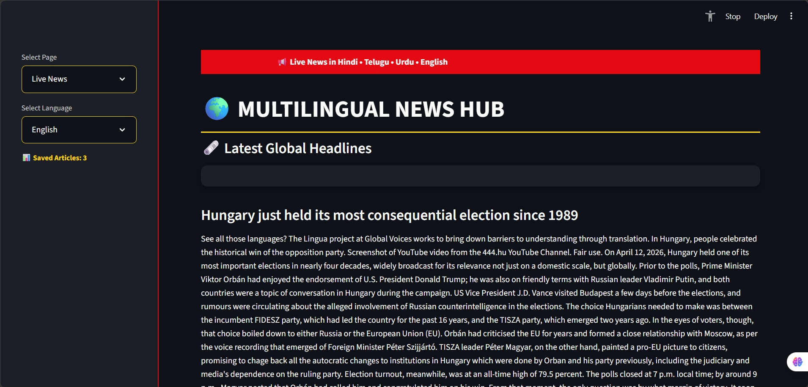
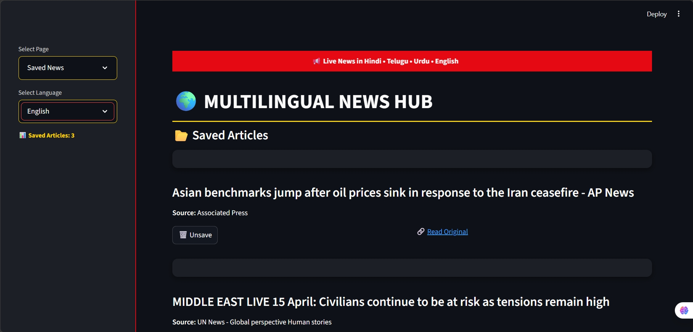
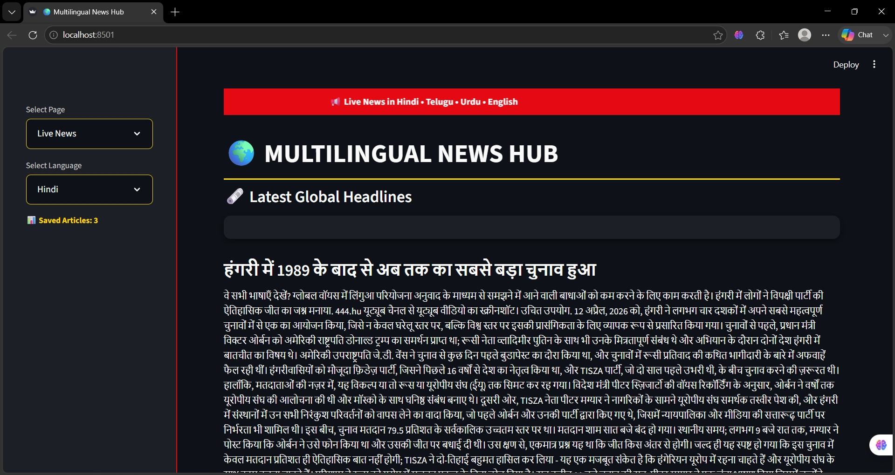

# 🌍 Multilingual News Hub – AI Powered Real-Time News Translator


---

## 🚀 Overview
Multilingual News Hub is an AI-powered web application that fetches global news and translates it into multiple languages in real-time.

---

## 🌐 Supported Languages
- English  
- Hindi  
- Telugu  
- Urdu  

---

## 💡 Problem Statement
Millions of people cannot access global news due to language barriers.

---

## ✅ Solution
This application:
- Fetches live news from global RSS feeds  
- Extracts full article content  
- Translates news into multiple languages using AI  
- Allows users to save articles for later reading  

---

## 🛠️ Tech Stack
- Python  
- Streamlit  
- SQLite  
- BeautifulSoup  
- Deep Translator  

---

## 🔥 Features
- 🌍 Real-time multilingual translation  
- 🗞️ Live global news feed  
- 💾 Save & manage articles  
- 🎨 Clean and modern UI  

---

## ⚙️ How It Works
1. Fetches news using RSS feeds  
2. Extracts full article content using BeautifulSoup  
3. Translates text using Deep Translator  
4. Displays content in selected language using Streamlit UI  

---
## Screenshots

### Homepage



### News Page


### Translated Page


## 🌟 Key Highlights
- Real-time multilingual translation  
- Clean and interactive UI  
- Scalable architecture for future AI features  

---

## ▶️ Run Locally
```bash
pip install -r
 requirements.txt
streamlit run final1.py
